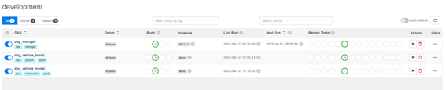
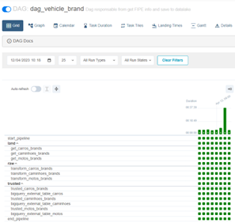
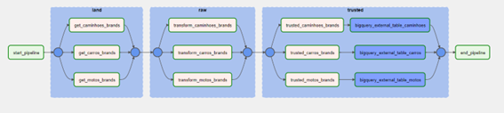
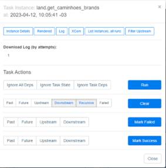
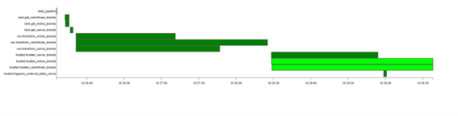
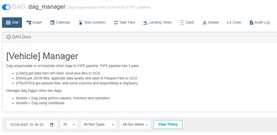
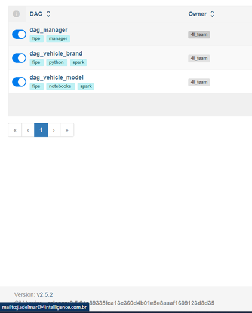
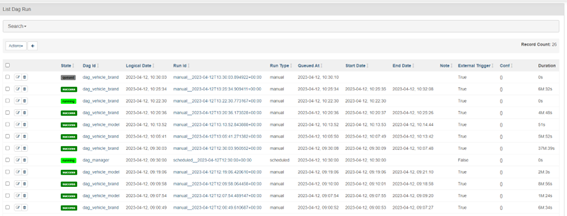
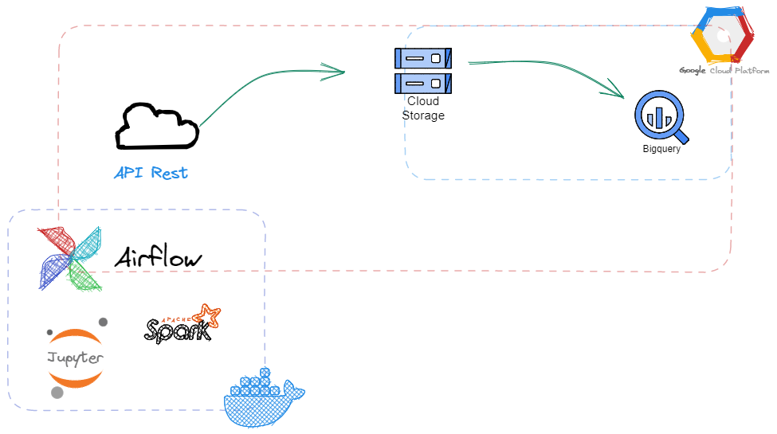

# Airflow example

This repo add an Airflow instance and helps to undesrtand how it works.

https://user-images.githubusercontent.com/129964889/230986212-c1dcdef6-d0a7-4d15-bd20-46b5ecd51d60.mp4

## What is this?

Airflow are a tool to orchestrate workflow, allowing integrations with any partners, open source and with a big community. 


## UI examples

### Control panel



### Dag visualization

Grid <br>


Graph <br>


### Task management



### Monitoring



### Context



### Notifications and alerts



### History




## How it works

Airflow can be implemented of too many ways. In this example, we choice docker option.

By default, airflow are divided in 3 big modules:

### Workers

The Airflow Worker module is responsible for executing the tasks defined in the Directed Acyclic Graphs (DAGs). These tasks are executed in parallel on different worker nodes through threads or processes, depending on the configuration defined in the environment.

Each Airflow worker node has a certain capacity for tasks that can be processed simultaneously, which can be increased or decreased to optimize the use of available resources. The Worker is also responsible for registering the task execution information in a metadata database so that the Scheduler can track task progress and reschedule them if necessary.

### Scheduler

The Scheduler is the Airflow module that manages the scheduling of tasks to be executed in DAGs. It constantly checks the execution status of tasks registered in the metadata database and makes decisions about which tasks should be executed next.

The Scheduler also handles rescheduling tasks in case of execution failures, as well as controlling the flow of task execution, ensuring that they are executed in the correct order and that dependencies between them are respected.

### Webserver

The Airflow Webserver module provides a web interface for interacting with Airflow. Through the Webserver interface, users can view the execution status of DAGs as well as individual tasks, manually execute or schedule tasks, monitor execution logs, and perform other operations related to Airflow management.

The Airflow Webserver interface is highly customizable and can be adjusted to meet the specific needs of different users or organizations. In addition, the Webserver is scalable and can be configured to work in clusters to handle large volumes of user traffic.


## Providers

Airflow allow integrate with many different providers, helping development. Here we can find [providers available](https://airflow.apache.org/docs/apache-airflow-providers/packages-ref.html).


## Ok, but how create a workflow?

In Airflow, workflows are defined by dag files. DAG (Directed Acyclic Graph) is a model to describe tasks, relation between tasks and time interval. Dag files are created in python (*.py) and allow use logical programation to define how it works.


# How to use

From use this repo, clone it: 

```bash
git clone https://github.com/jota4i/airflow_use_case.git

cd airflow_use_case

cp .env_example .env

55947924 - Atendimento com a Tokio Marine para confirmar se é uma empresa integra.

docker compose up

```

After finish docker process, will be available 3 services:

- Airflow UI (http://localhost:8181)
- Spark UI (http://localhost:8080)
- Jupyter notebook (http://localhost:8888)


By default, credentials to airflow are admin/admin (but can be changed in .env file).


## Dag example

We created a dag example to integrate with API Rest, save in GCP Bucket (land), normalize data in parquet files (raw) and add a table with trusted layer.





